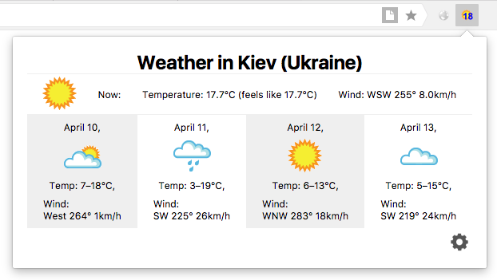

I started with as simple solution as possible.

Accordint to the task it seems we will not need any content scripts for this kind of extension:
> Always shows the temperature and weather conditions for my current location

I searched for weather API provider with good coverage and found [Wunderground](https://www.wunderground.com/weather/api/d/docs):
they allow to retrieve weather conditions for arbitrary places, as well as determine user's location by their IP address.
Also, they offer weather forecast for several upcoming days, which is useful option for such extension as well.

Eventually, I came up with the following UI for the first iteration of development:

This is simple browser action, after clicking on button user sees in popup their current determined location, weather conditions and forecast.
This data is fetched from API not more often than once in an hour.

You might notice there is an Options button in the corner. Right now it opens extension's Options page but the page itself has no settings.
As long as the goal is to make proof of concept rather than a completely working solution I'm going to stick with empty Options dialog.

Obvious options would be to allow user to choose whether they want:
- temperature in Celsius or Fahrenheit
- speed of wind in kilometers per hour or miles per hour

Also, we may want to give user an option to not only look for weather at current location, but to choose other.
Good option seems to have some list of favourite locations.

At that point we may notice a good fit here for React as template engine of both Popup and Options page.
Moreover, Redux with its single Store seems to be a good option for such extension.
So I'm going to refactor it to use React/Redux over the next iteration or two.

Ultimately, it became clear to me that it would be nice to look at the mobile market and have such extension for some mobile browser, which would allow to check weather on the go.
Looks like Mobile Yandex Browser nowadays allows to use those same WebExtension APIs to build mobile browser extensions.
Good point to start is to look at test report: https://yandex.github.io/browser-extensions/
Seems like it has everything we may need, so porting this extension to mobile should be easy.
